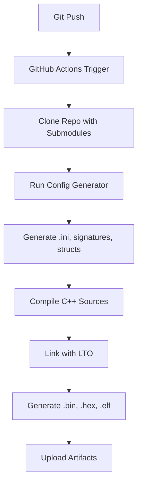

# Warkop-X ECU - Complete Source Code Documentation

**Version:** 1.0  
**MCU:** STM32F407VET6 (512KB Flash) / VGT6 (1024KB Flash)  
**Firmware Base:** rusEFI  
**Target:** Yamaha Vixion OLD (200cc Single Cylinder)

---

## 📚 Table of Contents

1. [Architecture Overview](#architecture-overview)
2. [Directory Structure](#directory-structure)
3. [Key Components](#key-components)
4. [Build System](#build-system)
5. [Configuration Files](#configuration-files)
6. [Hardware Abstraction](#hardware-abstraction)
7. [Engine Control Logic](#engine-control-logic)
8. [Closed Loop Control](#closed-loop-control)
9. [Communication Protocols](#communication-protocols)
10. [Development Workflow](#development-workflow)

---

## 1. Architecture Overview

### System Architecture

```
┌─────────────────────────────────────────────────────────────┐
│                   TunerStudio (PC/Mobile)                   │
│                  Configuration & Monitoring                  │
└────────────────┬────────────────────┬───────────────────────┘
                 │ UART/BT            │ CAN Bus
                 ▼                    ▼
┌────────────────────────────────────────────────────────────┐
│              Warkop-X ECU (STM32F407V)                     │
│                                                            │
│  ┌──────────────────────────────────────────────────────┐ │
│  │  Application Layer (rusEFI Firmware)                 │ │
│  │  - Fuel Map Calculation                              │ │
│  │  - Ignition Timing                                   │ │
│  │  - Closed Loop Control (AFR, Idle)                   │ │
│  │  - Sensor Processing                                 │ │
│  └──────────────────────────────────────────────────────┘ │
│                          ▲                                 │
│  ┌──────────────────────────────────────────────────────┐ │
│  │  Hardware Abstraction Layer (Board Config)          │ │
│  │  - Pin Assignments                                   │ │
│  │  - Peripheral Init (ADC, PWM, SPI, CAN)             │ │
│  │  - Interrupt Handlers                                │ │
│  └──────────────────────────────────────────────────────┘ │
│                          ▲                                 │
│  ┌──────────────────────────────────────────────────────┐ │
│  │  RTOS Layer (ChibiOS)                               │ │
│  │  - Task Scheduling                                   │ │
│  │  - Resource Management                               │ │
│  └──────────────────────────────────────────────────────┘ │
└─────┬────┬────┬────┬────┬────┬────┬────┬────┬────┬───────┘
      │    │    │    │    │    │    │    │    │    │
  ┌───▼─┐ ┌▼──┐ ┌▼──┐ ┌▼──┐ ┌▼──┐ ┌▼──┐ ┌▼──┐ ┌▼──┐ ┌▼──┐
  │ IGN │ │INJ│ │CKP│ │TPS│ │MAP│ │O2 │ │CAN│ │Fan│ │Oth│
  └─────┘ └───┘ └───┘ └───┘ └───┘ └───┘ └───┘ └───┘ └───┘
   Outputs    Inputs      Sensors     Comm   Actuators
```

### Software Layers

| Layer | Location | Purpose |
|-------|----------|---------|
| **Application** | `ext/rusefi/firmware/controllers/` | Engine logic, fuel/ignition calculations |
| **Board HAL** | `board_configuration.cpp` | Pin mapping, hardware initialization |
| **Defaults** | `default_tune.cpp` | Engine-specific default values |
| **Build Config** | `board.mk` | Feature enable/disable, compiler flags |
| **RTOS** | `ext/rusefi/firmware/ChibiOS/` | Real-time operating system |
| **Drivers** | `ext/rusefi/firmware/hw_layer/` | Low-level peripheral drivers |

---

## 2. Directory Structure

```
fw-Warkop-X-ECU/
│
├── 📁 Root Level (Board-Specific Files)
│   ├── board.mk                      ← Build configuration & feature flags
│   ├── board_configuration.cpp       ← Pin mapping & hardware init
│   ├── board_config.txt              ← TPS config override (ADC count mode)
│   ├── default_tune.cpp              ← Engine defaults (Vixion-specific)
│   ├── STM32F407VET6.ld              ← Linker script for 512KB variant
│   ├── meta-info.env                 ← Board metadata (name, signature)
│   └── readme.md                     ← Main documentation
│
├── 📁 docs/                          ← Documentation
│   ├── CAN_BUS_PINOUT.md             ← CAN bus wiring guide
│   └── QUICKSHIFT_SETUP.md           ← Quick shifter configuration
│
├── 📁 firmware/                      ← Board-specific firmware files
│   ├── board_overrides.h             ← Custom defines/macros
│   └── firmware.mk                   ← Firmware build rules
│
├── 📁 generated/                     ← Auto-generated code
│   ├── controllers/generated/        ← Config structs, enums
│   ├── signature_warkop_x.h          ← Firmware signature
│   └── tunerstudio/generated/        ← TunerStudio .ini files
│
├── 📁 ext/rusefi/                    ← rusEFI core (git submodule)
│   ├── firmware/                     ← Main firmware source
│   │   ├── controllers/              ← Engine control logic
│   │   │   ├── algo/                 ← Algorithms (fuel, ignition)
│   │   │   ├── actuators/            ← Idle, boost, ETB control
│   │   │   ├── math/                 ← Closed loop, PID
│   │   │   ├── sensors/              ← Sensor processing
│   │   │   └── trigger/              ← Trigger wheel decoding
│   │   ├── console/                  ← TunerStudio communication
│   │   ├── hw_layer/                 ← Hardware drivers
│   │   └── ChibiOS/                  ← RTOS
│   └── java_console/                 ← TunerStudio Java app
│
├── 📁 .github/workflows/             ← CI/CD
│   └── build-firmware.yaml           ← Auto-build on push
│
└── 📁 bin/                           ← Build scripts
    └── gen_image_board.sh            ← Generate ramdisk image
```

### Key File Purposes

| File | Purpose | Edit Frequency |
|------|---------|----------------|
| `board.mk` | Enable/disable features, compiler optimization | Often |
| `board_configuration.cpp` | Pin assignments, sensor configuration | Rarely |
| `default_tune.cpp` | Default fuel/ignition maps | Sometimes |
| `board_config.txt` | TunerStudio INI overrides | Rarely |
| `ext/rusefi/` | Core firmware (DO NOT EDIT) | Never |

---

## 3. Key Components

### 3.1 Board Configuration

**File:** [board_configuration.cpp](file:///Users/andikasulispratama/Documents/_DATA%20ANDIKA/RusEfi/fw-Warkop-X-ECU/board_configuration.cpp)

**Purpose:** Define hardware pin assignments and initialization

#### Key Function: `customBoardDefaultConfiguration()`

```cpp
static void customBoardDefaultConfiguration() {
    // ========== IGNITION OUTPUTS ==========
    engineConfiguration->ignitionPins[0] = Gpio::Unassigned;
    
    // ========== INJECTION OUTPUTS ==========
    engineConfiguration->injectionPins[0] = Gpio::Unassigned;
    
    // ========== TRIGGER INPUTS ==========
    engineConfiguration->triggerInputPins[0] = Gpio::Unassigned;
    
    // ========== SENSOR ADC CHANNELS ==========
    engineConfiguration->map.sensor.hwChannel = EFI_ADC_NONE;
    engineConfiguration->tps1_1AdcChannel = EFI_ADC_NONE;
    
    // ========== CAN BUS CONFIGURATION ==========
    engineConfiguration->canTxPin = Gpio::A12;  // CAN1_TX
    engineConfiguration->canRxPin = Gpio::A11;  // CAN1_RX
    engineConfiguration->canReadEnabled = true;
    engineConfiguration->canWriteEnabled = true;
}
```

**Customization Points:**
- Pin assignments for all I/O
- ADC channel mapping
- CAN bus enable/disable
- Default sensor thresholds

---

### 3.2 Build Configuration

**File:** [board.mk](file:///Users/andikasulispratama/Documents/_DATA%20ANDIKA/RusEfi/fw-Warkop-X-ECU/board.mk)

**Purpose:** Control firmware features and flash size optimization

#### Feature Flags

```makefile
# ========== DISABLED FEATURES (Flash Optimization) ==========
DDEFS += -DEFI_LUA=FALSE                      # Save ~40-60KB
DDEFS += -DEFI_ELECTRONIC_THROTTLE_BODY=FALSE # Save ~15-20KB
DDEFS += -DEFI_BOOST_CONTROL=FALSE            # Save ~10-15KB
DDEFS += -DEFI_VVT=FALSE                      # Save ~5-8KB
DDEFS += -DEFI_ANTILAG_SYSTEM=FALSE           # Save ~5-10KB

# ========== CAN BUS CONFIGURATION ==========
DDEFS += -DEFI_CAN_SUPPORT=TRUE              # Enable CAN for dashboard
DDEFS += -DEFI_CAN_SERIAL=FALSE              # Disable CAN serial (not needed)
DDEFS += -DEFI_VERBOSE_CAN_TX=FALSE          # Save RAM/Flash

# ========== COMPILER OPTIMIZATIONS ==========
USE_OPT += -Os -fomit-frame-pointer          # Optimize for size
USE_LTO = yes                                 # Link-time optimization
USE_OPT += -ffunction-sections -fdata-sections -Wl,--gc-sections
```

**Impact:** Net flash savings ~75-120KB despite CAN bus enabled

---

### 3.3 Default Tune

**File:** [default_tune.cpp](file:///Users/andikasulispratama/Documents/_DATA%20ANDIKA/RusEfi/fw-Warkop-X-ECU/default_tune.cpp)

**Purpose:** Yamaha Vixion OLD specific engine defaults

```cpp
void setDefaultEngineConfiguration() {
    // Engine basics
    engineConfiguration->cylindersCount = 1;
    engineConfiguration->firingOrder = FO_1;
    engineConfiguration->displacement = 0.2f;  // 200cc
    engineConfiguration->cylinderBore = 67.0f;  // 67mm
    
    // Injection
    engineConfiguration->injector.flow = 180;   // 180 cc/min
    engineConfiguration->injectionMode = IM_SEQUENTIAL;
    
    // Ignition
    engineConfiguration->ignitionMode = IM_INDIVIDUAL_COILS;
    engineConfiguration->crankingTimingAngle = 10;
    
    // Idle
    setupIdleControl();  // CLT-based idle target
    
    // Rev limiter
    engineConfiguration->rpmHardLimit = 12000;
    
    // Trigger
    engineConfiguration->trigger.customTotalToothCount = 12;
    engineConfiguration->trigger.customSkippedToothCount = 1;
}
```

---

### 3.4 TunerStudio INI Override

**File:** [board_config.txt](file:///Users/andikasulispratama/Documents/_DATA%20ANDIKA/RusEfi/fw-Warkop-X-ECU/board_config.txt)

**Purpose:** Override TunerStudio config (TPS ADC mode fix)

```
! Warkop-X Board TPS Configuration Override
! Override the default tps_limit_t definition to use ADC count instead of voltage
! Original: custom tps_limit_t 2 scalar, S16, @OFFSET@, "V", 0.005, 0, 0, 5, 2
! New: ADC count based (0-1023 for 10-bit ADC)

custom tps_limit_t 2 scalar, S16, @OFFSET@, "ADC", 1, 0, 0, 1023, 0
```

**Reason:** rusEFI default uses voltage (0-5V), but Warkop-X ECU needs ADC count (0-1023) for TPS calibration dialog to work correctly.

---

## 4. Build System

### Build Flow



### GitHub Actions

**File:** `.github/workflows/build-firmware.yaml`

```yaml
on:
  push:              # Auto-build on every push
  schedule:          # Daily build at midnight
  workflow_dispatch: # Manual trigger

jobs:
  build-firmware:
    - Checkout with submodules
    - Generate board files (signatures, configs)
    - Compile firmware (ARM GCC 14.2)
    - Upload artifacts:
        * Firmware_BINARY_297KB_*.bin
        * Firmware_HEX_474KB_*.hex
        * TunerStudio_INI_*.ini
```

### Local Build

```bash
# Clone repository
git clone --recursive https://github.com/andikasulis/fw-Warkop-X-ECU.git
cd fw-Warkop-X-ECU

# Build firmware
cd ext/rusefi/firmware
bash ../../../compile_firmware.sh ../../../meta-info.env

# Output files
ls -lh build/rusefi.*
# rusefi.bin  (297KB) - for DFU flash
# rusefi.hex  (474KB) - for ST-Link
# rusefi.elf         - for debugging
```

---

## 5. Configuration Files

### 5.1 Meta Info

**File:** [meta-info.env](file:///Users/andikasulispratama/Documents/_DATA%20ANDIKA/RusEfi/fw-Warkop-X-ECU/meta-info.env)

```bash
SHORT_BOARD_NAME=warkop_x
BOARD_DEFINITION_NAME="Warkop X R1"
BOARD_SPECIFIC_URL=https://github.com/andikasulis/fw-Warkop-X-ECU
```

Used for:
- Firmware signature generation
- TunerStudio board identification
- GitHub build artifacts naming

---

### 5.2 Linker Script (VET6 Variant)

**File:** [STM32F407VET6.ld](file:///Users/andikasulispratama/Documents/_DATA%20ANDIKA/RusEfi/fw-Warkop-X-ECU/STM32F407VET6.ld)

```ld
MEMORY
{
  flash : org = 0x08000000, len = 512k   /* 512KB flash */
  ram   : org = 0x20000000, len = 128k   /* 128KB RAM */
}
```

**Purpose:** Define memory layout for STM32F407VET6 (512KB variant)

---

## 6. Hardware Abstraction

### 6.1 Pin Abstraction

**Enum:** `Gpio` in `ext/rusefi/firmware/hw_layer/io/` 

```cpp
enum class Gpio : uint16_t {
    Unassigned = 0,
    A0, A1, A2, ..., A15,
    B0, B1, B2, ..., B15,
    C0, C1, C2, ..., C15,
    ...
};
```

**Usage:**
```cpp
engineConfiguration->canTxPin = Gpio::A12;
```

### 6.2 ADC Channels

**Enum:** `adc_channel_e`

```cpp
EFI_ADC_NONE = 0,
EFI_ADC_0,    // PA0
EFI_ADC_1,    // PA1
EFI_ADC_2,    // PA2
...
EFI_ADC_15    // PC5
```

**Usage:**
```cpp
engineConfiguration->tps1_1AdcChannel = EFI_ADC_3; // PA3
```

---

## 7. Engine Control Logic

### 7.1 Fuel Calculation

**Location:** `ext/rusefi/firmware/controllers/algo/fuel/`

#### Main Flow

```
1. Read Sensors (TPS, RPM, CLT, IAT, MAP)
   ↓
2. Determine Engine Load
   - Alpha-N: load = TPS%
   - Speed-Density: load = MAP
   ↓
3. Base Fuel Calculation
   VE = interpolate2D(RPM, Load, VE_Table)
   baseFuel = (VE * airMass) / AFR_target
   ↓
4. Apply Corrections
   - CLT correction (cold enrichment)
   - IAT correction
   - Accel enrichment
   - Wall wetting
   - Closed loop (AFR trim)
   ↓
5. Calculate Injector Pulse Width
   pulseWidth = (baseFuel / injFlow) + deadtime
   ↓
6. Output to Injector
```

**Key Function:** `getInjectionDuration()` in `fuel_math.cpp`

---

### 7.2 Ignition Timing

**Location:** `ext/rusefi/firmware/controllers/algo/advance_map.cpp`

#### Timing Calculation

```
1. Base Timing from Map
   baseTiming = interpolate2D(RPM, Load, Ignition_Table)
   ↓
2. Apply Corrections
   - Idle timing correction
   - CLT timing correction  
   - Knock retard
   - Launch control retard
   ↓
3. Add Global Offset
   finalTiming = baseTiming + globalOffset
   ↓
4. Schedule Ignition Event
   fireAtAngle = TDC - finalTiming
```

---

## 8. Closed Loop Control

### 8.1 Fuel Trim (STFT/LTFT)

**See:** [closed_loop_reference.md](file:///Users/andikasulispratama/.gemini/antigravity/brain/e424e793-cc38-4916-b45f-994d432262aa/closed_loop_reference.md)

**Main Class:** `ShortTermFuelTrim`  
**File:** `ext/rusefi/firmware/controllers/math/closed_loop_fuel.cpp`

**Algorithm:**
```cpp
// 1. Get lambda error
error = (targetLambda - measuredLambda) / targetLambda

// 2. Integrate error (if within deadband)
if (abs(error) > deadband) {
    adjustment += error * integrator_gain * dt
}

// 3. Clamp to limits
adjustment = clamp(adjustment, minAdj, maxAdj)

// 4. Apply to fuel
fuelCorrection = 1.0 + adjustment  // e.g., 1.05 = +5% fuel
```

---

### 8.2 Idle Control

**Main Class:** `IdleController`  
**File:** `ext/rusefi/firmware/controllers/actuators/idle_thread.cpp`

**PID Control:**
```cpp
// PID Formula
error = targetRPM - currentRPM
P = Kp * error
I = Ki * ∫error dt
D = Kd * d(error)/dt

output = P + I + D

// Output to actuator
idleValveDuty = clamp(output, 0%, 100%)
```

---

## 9. Communication Protocols

### 9.1 TunerStudio (UART)

**Protocol:** Binary protocol over UART1 (115200 baud)

**Commands:**
- `pageReadWrite` - Read/write config
- `outputChannels` - Live data
- `io_test_command` - Run tests (e.g., TPS calibration)

**Implementation:** `ext/rusefi/firmware/console/binary/`

---

### 9.2 CAN Bus

**See:** [CAN_BUS_PINOUT.md](file:///Users/andikasulispratama/Documents/_DATA%20ANDIKA/RusEfi/fw-Warkop-X-ECU/docs/CAN_BUS_PINOUT.md)

**Pins:** PA11 (RX), PA12 (TX)  
**Baud Rate:** 500 kbps (configurable)  
**Protocol:** rusEFI native CAN

**Broadcast Data:**
- RPM
- TPS
- CLT/IAT
- MAP
- AFR
- Battery voltage

**Implementation:** `ext/rusefi/firmware/hw_layer/drivers/can/`

---

## 10. Development Workflow

### 10.1 Modify Configuration

#### Step 1: Edit Board Files

```bash
# Pin changes
vim board_configuration.cpp

# Feature enable/disable
vim board.mk

# Engine defaults
vim default_tune.cpp
```

#### Step 2: Commit Changes

```bash
git add board_configuration.cpp board.mk default_tune.cpp
git commit -m "feat: Add quick shifter support"
git push
```

#### Step 3: Wait for Build

GitHub Actions will automatically build firmware (~5-10 min)

#### Step 4: Download Artifacts

Go to **Actions** tab → Download `.bin` or `.hex`

#### Step 5: Flash to ECU

```bash
st-flash write rusefi_warkop_x_*.bin 0x08000000
```

---

### 10.2 Enable Optional Features

#### Example: Enable Knock Detection

```makefile
# In board.mk, uncomment:
DDEFS += -DEFI_SOFTWARE_KNOCK=TRUE
DDEFS += -DKNOCK_SPECTROGRAM=TRUE
```

**Impact:** +15-20KB flash

---

### 10.3 Debugging

#### View Build Logs

```bash
# In GitHub Actions, click on failed build
# Check "Compile firmware" step for errors
```

#### Check Flash Usage

```bash
arm-none-eabi-size build/rusefi.elf
#    text    data     bss     dec     hex filename
#  480000   12000   50000  542000   84530 build/rusefi.elf
```

**Target:** text + data < 512000 (512KB)

---

## 📊 Summary

### Key Takeaways

1. **Modular Architecture**
   - Board-specific files in root
   - Core firmware in `ext/rusefi/` (read-only)
   - Clear separation of concerns

2. **Flash Optimization**
   - ~100KB saved via feature flags
   - LTO + garbage collection
   - CAN bus still functional

3. **Customization Points**
   - `board.mk` - Features
   - `board_configuration.cpp` - Pins
   - `default_tune.cpp` - Engine defaults
   - `board_config.txt` - TunerStudio overrides

4. **Closed Loop Control**
   - STFT/LTFT for AFR
   - PID for idle speed
   - Separate enable flags

5. **Build System**
   - GitHub Actions auto-build
   - Artifacts ready to flash
   - Local build supported

---

## 🔗 Quick Reference

| Task | File/Command |
|------|--------------|
| Change pins | [`board_configuration.cpp`](file:///Users/andikasulispratama/Documents/_DATA%20ANDIKA/RusEfi/fw-Warkop-X-ECU/board_configuration.cpp) |
| Enable feature | [`board.mk`](file:///Users/andikasulispratama/Documents/_DATA%20ANDIKA/RusEfi/fw-Warkop-X-ECU/board.mk) |
| Engine defaults | [`default_tune.cpp`](file:///Users/andikasulispratama/Documents/_DATA%20ANDIKA/RusEfi/fw-Warkop-X-ECU/default_tune.cpp) |
| CAN bus setup | [`docs/CAN_BUS_PINOUT.md`](file:///Users/andikasulispratama/Documents/_DATA%20ANDIKA/RusEfi/fw-Warkop-X-ECU/docs/CAN_BUS_PINOUT.md) |
| Closed loop | [`closed_loop_reference.md`](file:///Users/andikasulispratama/.gemini/antigravity/brain/e424e793-cc38-4916-b45f-994d432262aa/closed_loop_reference.md) |
| Build firmware | `bash compile_firmware.sh meta-info.env` |
| Flash | `st-flash write rusefi.bin 0x08000000` |

---

**Made with ❤️ for Warkop-X ECU Development**
