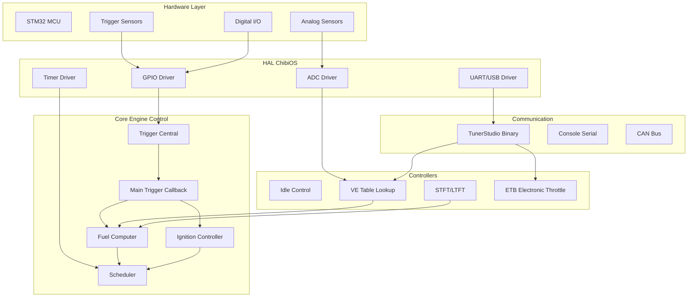
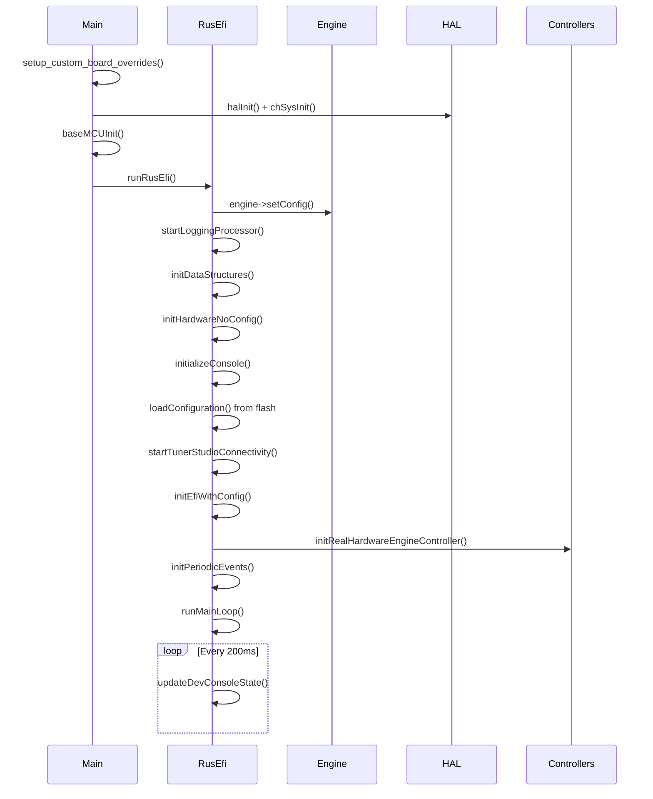
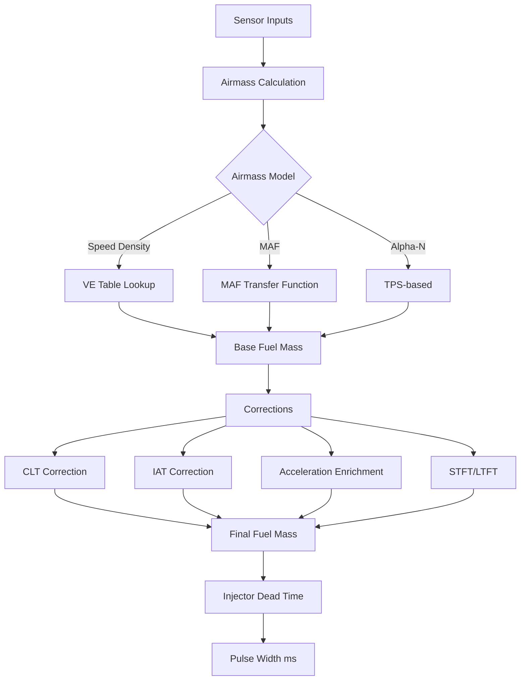
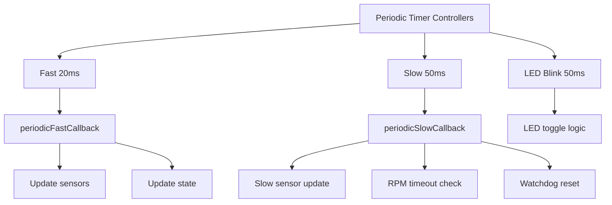

# RusEfi Firmware - Dokumentasi Pembelajaran Lengkap

## 📚 Daftar Isi

1. [Pengenalan Firmware RusEfi](#pengenalan)
2. [Arsitektur Keseluruhan](#arsitektur)
3. [Startup & Initialization Flow](#startup-flow)
4. [Main Control Loop](#main-control-loop)
5. [Trigger System (Crank/Cam Decoder)](#trigger-system)
6. [Fuel Injection Logic](#fuel-injection)
7. [Ignition Timing Logic](#ignition-timing)
8. [Sensor Processing](#sensor-processing)
9. [Communication Protocols](#communication)
10. [Periodic Tasks](#periodic-tasks)
11. [Configuration System](#configuration)
12. [Build System](#build-system)
13. [Customization untuk Warkop X ECU](#warkop-customization)

---

## 1. Pengenalan Firmware RusEfi {#pengenalan}

RusEfi adalah **open-source engine management system** yang dirancang untuk:
- **Modern 100+ MHz microcontrollers** (STM32F4/F7/H7)
- **Processor-independent** implementation (maksimal portability)
- **Event-driven architecture** berdasarkan trigger events
- **High-level abstraction** (software PWM, HAL dependency)

### Filosofi Desain

> "With modern 100+ MHz microprocessors, the relatively undemanding task of internal combustion engine control could be implemented in a high-level, processor-independent (to some extent) manner."

### Key Concepts
- ✅ **Dependency on HAL** (Hardware Abstraction Layer)
- ✅ **Software-based PWM** generation
- ✅ **Angle-based scheduling** dengan time-based offset
- ✅ **Modular architecture** untuk flexibility

---

## 2. Arsitektur Keseluruhan {#arsitektur}



### Struktur Direktori Firmware

```
ext/rusefi/firmware/
├── main.cpp                    # Entry point
├── rusefi.cpp                  # Main initialization
├── controllers/
│   ├── engine_controller.cpp   # Controller init
│   ├── engine_cycle/           # Main loop logic
│   │   └── main_trigger_callback.cpp
│   ├── algo/                   # Algorithms
│   │   ├── airmass/            # VE, MAF, Alpha-N
│   │   └── fuel_math.cpp       # Fuel calculations
│   ├── actuators/              # Injectors, ignition
│   ├── sensors/                # Sensor processing
│   ├── trigger/                # Trigger decoder
│   ├── math/                   # STFT, closed loop
│   └── system/                 # System tasks
├── hw_layer/                   # Hardware abstraction
├── console/                    # Communication
├── init/                       # Initialization
└── config/                     # Default configs
```

---

## 3. Startup & Initialization Flow {#startup-flow}

### Boot Sequence



### File: [`main.cpp`](file:///Users/andikasulispratama/Documents/_DATA%20ANDIKA/RusEfi/fw-Warkop-X-ECU/ext/rusefi/firmware/main.cpp)

```cpp
int main(void) {
    setup_custom_fw_overrides();
    setup_custom_board_overrides();  // ← Your board customization!
    preHalInit();
    call_board_override(custom_board_preHalInit);
    
    // ChibiOS/RT initialization
    halInit();
    chSysInit();
    
    // MCU initialization (no config access)
    baseMCUInit();
    
    runRusEfi();  // ← Never returns
    return 0;
}
```

### File: [`rusefi.cpp`](file:///Users/andikasulispratama/Documents/_DATA%20ANDIKA/RusEfi/fw-Warkop-X-ECU/ext/rusefi/firmware/rusefi.cpp)

#### Step 1: Pre-Configuration Init (Line 174-234)

```cpp
void runRusEfi() {
    engine->setConfig();
    
    // Initialize logging ASAP
    startLoggingProcessor();
    
    // Watchdog
    setWatchdogResetPeriod(WATCHDOG_RESET_MS);
    startWatchdog();
    
    // Init table structures BEFORE loading config
    initDataStructures();
    
    // Hardware init (no config needed)
    initHardwareNoConfig();
    
    // Detect board type
    detectBoardType();
    
    // Module init (no configuration)
    engine->engineModules.apply_all([](auto & m) {
        m.initNoConfiguration();
    });
    
    // Start console/USB
    initializeConsole();
    startUsbConsole();
    
    // Load configuration from flash
    loadConfiguration();  // ← Critical!
    
    // Start TunerStudio
    startTunerStudioConnectivity();
    startSerialChannels();
    
    // Initialize with configuration
    initEfiWithConfig();
    
    // Start periodic events
    initPeriodicEvents();
    
    // Enter main loop
    runMainLoop();
}
```

#### Step 2: Init With Configuration (Line 254-286)

```cpp
void initEfiWithConfig() {
    // setjmp/longjmp for assertion recovery
    if (setjmp(jmpEnv)) {
        return;  // Assertion failure - abort init
    }
    
    commonEarlyInit();
    
    // Validate config sanity
    if (validateConfigOnStartUpOrBurn()) {
        initRealHardwareEngineController();
        rememberCurrentConfiguration();
    }
}
```

#### Step 3: Engine Controller Init (engine_controller.cpp:752)

```cpp
void initRealHardwareEngineController() {
    commonInitEngineController();  // ← Core engine init
    initWarningRunningPins();
    
    #if EFI_LOGIC_ANALYZER
    if (engineConfiguration->isWaveAnalyzerEnabled) {
        initWaveAnalyzer();
    }
    #endif
    
    engineStateBlinkingTask.start();  // LED blink task
    initVrThresholdPwm();
}
```

### Common Engine Controller Init (engine_controller.cpp:386-497)

Initialization sequence lengkap:

```cpp
void commonInitEngineController() {
    // 1. Output signals (injectors, ignition coils)
    prepareOutputSignals();
    engine->injectionEvents.addFuelEvents();
    
    // 2. Settings & console commands
    initSettings();
    
    // 3. Subsystems
    initBenchTest();
    initAlternatorCtrl();
    initVvtActuators();
    initMalfunctionIndicator();
    
    // 4. Sensors
    initNewSensors();
    initSensors();
    
    // 5. Controllers
    initAccelEnrichment();
    initScriptImpl();
    initGpPwm();
    startIdleThread();
    initGearController();
    initButtonDebounce();
    initElectronicThrottle();
    initMapAveraging();
    initBoostCtrl();
    initLaunchControl();
    initIgnitionAdvanceControl();
    initAuxValves();
    initSpeedometer();
    
    // 6. Closed-loop fuel trim
    initStft();
    initLtft();
}
```

---

## 4. Main Control Loop {#main-control-loop}

### Event-Driven Architecture

RusEfi **BUKAN polling-based**, melainkan **event-driven**:
- Main loop hanya untuk **status reporting**
- Engine control logic ada di **main_trigger_callback**

### Main Loop (rusefi.cpp:288-304)

```cpp
void runMainLoop() {
    efiPrintf("Running main loop");
    main_loop_started = true;
    
    while (true) {
        // Console state update (mostly dead code)
        updateDevConsoleState();
        
        // Sleep 200ms - sangat slow!
        chThdSleepMilliseconds(200);
    }
}
```

> [!IMPORTANT]
> **Main loop hanya sleep!** Logic sebenarnya ada di interrupt-driven callbacks.

### The Real Main Loop: Trigger Callback

File: [`main_trigger_callback.cpp`](file:///Users/andikasulispratama/Documents/_DATA%20ANDIKA/RusEfi/fw-Warkop-X-ECU/ext/rusefi/firmware/controllers/engine_cycle/main_trigger_callback.cpp)

Ini adalah **jantung dari engine control**:

```cpp
void mainTriggerCallback(...) {
    // Dipanggil setiap kali ada trigger event!
    
    // 1. Calculate RPM
    engine->rpmCalculator.onNewEngineCycle();
    
    // 2. Calculate fuel amount
    engine->fuelComputer.running();
    
    // 3. Calculate ignition timing
    prepareIgnitionSchedule();
    
    // 4. Schedule injector events
    engine->injectionEvents.addFuelEvents();
    
    // 5. Schedule ignition events
    engine->ignitionEvents.addIgnitionEvents();
    
    // 6. Execute scheduled events at correct angle
    scheduleByAngle(...);
}
```

---

## 5. Trigger System (Crank/Cam Decoder) {#trigger-system}

### Konsep Trigger Decoding

RusEfi mendukung berbagai macam trigger pattern:
- **36-1** (VW, Nissan)
- **60-2** (Mercedes, BMW)
- **24-1**, **12-1**, dll
- **Dual wheel** (Crank + Cam)
- **Distributor** (single tooth)

### Synchronization Logic

Dari dokumentasi di [`rusefi.cpp:32-48`](file:///Users/andikasulispratama/Documents/_DATA%20ANDIKA/RusEfi/fw-Warkop-X-ECU/ext/rusefi/firmware/rusefi.cpp#L32-L48):

```cpp
/**
 * Trigger decoder berdasarkan synchronizing primary shaft signal
 * dan counting events pada secondary signal.
 * 
 * Typical scenario:
 * - Primary signal: Cam shaft sensor
 * - Secondary signal: Crank shaft sensor
 * 
 * Decoder dikonfigurasi untuk act on rise or fall.
 * Compares duration dari previous signal ke signal sebelumnya.
 * 
 * Jika ratio antara syncRatioFrom dan syncRatioTo:
 * → Ini adalah synchronizing event!
 * 
 * Example 36/1:
 * - Sync ratio: 1.5 to 3
 * - Missing tooth = 2x duration → trigger sync
 */
```

### Trigger Central

Location: `controllers/trigger/trigger_central.cpp`

```cpp
void TriggerCentral::handleShaftSignal(...) {
    // 1. Process trigger event
    triggerState.decodeTriggerEvent(...);
    
    // 2. Check if synchronized
    if (triggerState.shaft_is_synchronized) {
        // 3. Call main trigger callback
        mainTriggerCallback(...);
    }
}
```

---

## 6. Fuel Injection Logic {#fuel-injection}

### Fuel Calculation Flow



### Speed Density (VE Table Method)

File: [`speed_density.cpp`](file:///Users/andikasulispratama/Documents/_DATA%20ANDIKA/RusEfi/fw-Warkop-X-ECU/ext/rusefi/firmware/controllers/math/speed_density.cpp)

```cpp
// VE table: volumetric efficiency per RPM x Load
ve_Map3D_t veMap{"ve"};

void initSpeedDensity() {
    veMap.initTable(
        config->veTable,      // 16x16 table
        config->veRpmBins,    // RPM axis
        config->veLoadBins    // Load axis (MAP or TPS)
    );
}
```

### Airmass Calculation

File: [`airmass.cpp`](file:///Users/andikasulispratama/Documents/_DATA%20ANDIKA/RusEfi/fw-Warkop-X-ECU/ext/rusefi/firmware/controllers/algo/airmass/airmass.cpp)

```cpp
float AirmassVeModelBase::getVe(float rpm, float load, bool postState) const {
    // 1. Get base VE from table (3D interpolation)
    percent_t ve = m_veTable->getValue(rpm, load);
    
    // 2. If idle, blend with idle VE table
    if (useSeparateVeForIdle && isIdling) {
        percent_t idleVe = interpolate3d(...);
        ve = interpolateClamped(...);  // Blend
    }
    
    // 3. Apply VE blends (adjustments)
    for (auto& blend : config->veBlends) {
        ve *= (100 + blend.Value) * 0.01f;
    }
    
    return ve * PERCENT_DIV;  // Convert to 0-1 range
}
```

### Fuel Corrections

1. **CLT (Coolant Temperature) Correction**
   - Table: `config->cltFuelCorrBins` / `cltFuelCorr`
   - Enrichment saat mesin dingin

2. **IAT (Intake Air Temperature) Correction**
   - Table: `config->iatFuelCorrBins` / `iatFuelCorr`
   - Kompensasi air density changes

3. **Acceleration Enrichment**
   - TPS rate of change detection
   - Delta fuel injection saat akselerasi

4. **STFT/LTFT (Closed Loop)**
   - Lihat [dokumentasi VE auto-tune](file:///Users/andikasulispratama/.gemini/antigravity/brain/c32480ff-dae4-4934-8483-6c79c9c0ba71/ve_autotune_explanation.md)

---

## 7. Ignition Timing Logic {#ignition-timing}

### Ignition Advance Calculation

```mermaid
graph LR
    A[RPM + Load] --> B[Base Timing Table]
    B --> C[Base Advance]
    C --> D[+CLT Correction]
    D --> E[+IAT Correction]
    E --> F[+Idle Timing]
    F --> G[+Flex Fuel Correction]
    G --> H[Final Advance]
    H --> I[Convert to Dwell]
    I --> J[Schedule Coil Charge]
    J --> K[Schedule Spark Fire]
```



### Ignition Table Lookup

```cpp
// Location: controllers/algo/advance_map.cpp
float getAdvance(float rpm, float load) {
    // 1. Base timing dari table
    angle_t advance = interpolate3d(
        config->ignitionTable,
        config->ignitionLoadBins, load,
        config->ignitionRpmBins, rpm
    );
    
    // 2. CLT correction
    advance += interpolate2d(
        engineState.clt,
        config->ignitionCltCorrTempBins,
        config->ignitionCltCorr
    );
    
    // 3. IAT correction
    advance += interpolate2d(...);
    
    // 4. Idle timing adjustment
    if (isIdling) {
        advance += getIdleAdvance();
    }
    
    return advance;
}
```

### Dwell Time Calculation

**Dwell** = waktu pengisian koil ignisi (ms)

```cpp
// Location: controllers/actuators/ignition.cpp
floatms_t getSparkDwell(int rpm) {
    // Voltage-corrected dwell
    float vBatt = Sensor::get(SensorType::BatteryVoltage).value_or(12.0f);
    
    float baseDwell = interpolate2d(
        rpm,
        config->sparkDwellRpmBins,
        config->sparkDwellValues
    );
    
    float voltageCorr = interpolate2d(
        vBatt,
        config->dwellVoltageCorrVoltBins,
        config->dwellVoltageCorrValues
    );
    
    return baseDwell * voltageCorr;
}
```

### Hybrid Scheduler

Penjelasan dari [`rusefi.cpp:61-86`](file:///Users/andikasulispratama/Documents/_DATA%20ANDIKA/RusEfi/fw-Warkop-X-ECU/ext/rusefi/firmware/rusefi.cpp#L61-L86):

**Problem**: Ignition perlu **angle-based timing** (fire at 700°) tapi **time-based dwell** (charge for 4ms)

**Solution**: Hybrid scheduler
- Calculate dwell in **degrees** based on current RPM
- Schedule coil charge as **angle-based event**
- Schedule spark fire as **angle-based event**
- Offset dari trigger event terdekat

**Example**:
```
RPM = 600 (360° = 100ms)
Spark timing = 700° BTDC
Dwell = 4ms = 14.4° at 600 RPM

Trigger events: 0°, 90°, 600°, 690°

Solution:
- Schedule coil ON at: 690° trigger + (700° - 14.4° - 690°) = delay
- Schedule spark at: 690° trigger + (700° - 690°) * time_per_degree
```

---

## 8. Sensor Processing {#sensor-processing}

### Sensor Framework

RusEfi menggunakan **Sensor** abstraction layer:

```cpp
// Location: util/sensor.h
class Sensor {
public:
    // Get sensor value with validation
    static expected<float> get(SensorType type);
    static float getOrZero(SensorType type);
    
    // Register sensor
    static void registerSensor(SensorType type, Sensor* sensor);
};
```

### Sensor Types

Location: `controllers/sensors/`

| Sensor Type | File | Description |
|-------------|------|-------------|
| **TPS** | `tps.cpp` | Throttle Position Sensor (ADC) |
| **CLT** | `thermistors.cpp` | Coolant Temp (NTC thermistor) |
| **IAT** | `thermistors.cpp` | Intake Air Temp |
| **MAP** | `map.cpp` | Manifold Absolute Pressure |
| **AFR** | `lambda_monitor.cpp` | Wideband O2 sensor |
| **RPM** | `rpm_calculator.cpp` | Computed from trigger |
| **VBatt** | `battery_sensor.cpp` | Battery voltage (ADC) |

### ADC Processing

Location: `hw_layer/adc/`

```cpp
// Fast ADC callback: 10 kHz
void fastAdcCallback() {
    // Read all fast channels (TPS, MAP, etc)
    for (auto& channel : fastChannels) {
        float voltage = readAdcVoltage(channel);
        Sensor::setInvalidatedValue(channel.type, voltage);
    }
}

// Slow ADC callback: slower rate
void slowAdcCallback() {
    // Read slow channels (CLT, IAT, etc)
    // ...
}
```

### Thermistor Conversion

NTC thermistor → temperature conversion:

```cpp
// Steinhart-Hart equation
float convertThermistor(float resistance, thermistor_conf_t& config) {
    float logR = logf(resistance);
    float invT = config.a + config.b * logR + config.c * logR * logR * logR;
    return 1.0f / invT - 273.15f;  // Kelvin → Celsius
}
```

---

## 9. Communication Protocols {#communication}

### TunerStudio Binary Protocol

Location: `console/binary/tunerstudio.cpp`

RusEfi komunikasi dengan TunerStudio via **binary protocol**:

```cpp
// Command structure
struct ts_command {
    uint8_t command;
    uint16_t offset;
    uint16_t count;
    uint8_t data[];
};

// Commands
#define TS_OUTPUT_COMMAND     'O'  // Live data
#define TS_PAGE_COMMAND       'P'  // Configuration page
#define TS_BURN_COMMAND       'B'  // Burn to flash
#define TS_CRC_CHECK_COMMAND  'k'  // CRC check
```

### Output Channels (Live Data)

```cpp
void updateTunerStudioState() {
    // Populate output channels structure
    engine->outputChannels.rpm = Sensor::getOrZero(SensorType::Rpm);
    engine->outputChannels.tps = Sensor::getOrZero(SensorType::Tps1);
    engine->outputChannels.clt = Sensor::getOrZero(SensorType::Clt);
    engine->outputChannels.afr = Sensor::getOrZero(SensorType::Lambda1);
    // ... 300+ channels
    
    // Send to TunerStudio
    sendOutputChannels();
}
```

### Configuration Write

```cpp
void handlePageWrite(uint16_t offset, uint8_t* data, uint16_t count) {
    // Write to configuration struct
    memcpy((uint8_t*)engineConfiguration + offset, data, count);
    
    // Increment version to trigger reload
    incrementGlobalConfigurationVersion("TS write");
}
```

### Console Commands

Location: `console/eficonsole.cpp`

```cpp
// Register console command
addConsoleAction("reset_accel", resetAccel);
addConsoleActionI("get_float", getFloat);
addConsoleActionII("set_int", setInt);
```

Examples:
```
> sensorinfo         # Show all sensor values
> get_float 100      # Read config offset 100
> set_int 100 500    # Write value 500 to offset 100
```

---

## 10. Periodic Tasks {#periodic-tasks}

### Task Hierarchy

RusEfi menggunakan **periodic timer controllers**:



### Fast Callback (20ms)

Location: `engine_controller.cpp:120-128`

```cpp
class PeriodicFastController : public PeriodicTimerController {
    void PeriodicTask() override {
        engine->periodicFastCallback();
    }
    
    int getPeriodMs() override {
        return FAST_CALLBACK_PERIOD_MS;  // 20ms
    }
};
```

**Tasks:**
- Update high-priority sensors
- Update engine state
- Fast control loops

### Slow Callback (50ms)

```cpp
class PeriodicSlowController : public PeriodicTimerController {
    void PeriodicTask() override {
        doPeriodicSlowCallback();
    }
    
    int getPeriodMs() override {
        return SLOW_CALLBACK_PERIOD_MS;  // 50ms
    }
};
```

**Tasks:**
- RPM calculator slow callback
- Check if engine stopped
- Reset acceleration enrichment
- TCU gear controller update
- **Watchdog reset!**

---

## 11. Configuration System {#configuration}

### Configuration Structure

Location: `config/boards/generated/engine_configuration_generated_structures.h`

```cpp
// Main config struct (~64KB!)
struct engine_configuration_s {
    // Engine specs
    uint8_t cylindersCount;
    float displacement;
    
    // Tables
    scaled_channel<uint16_t, 10, 1> veTable[16][16];
    scaled_channel<int16_t, 10, 1> ignitionTable[16][16];
    
    // Pins
    output_pin_e injectionPins[MAX_CYLINDER_COUNT];
    output_pin_e ignitionPins[MAX_CYLINDER_COUNT];
    brain_input_pin_e triggerInputPins[TRIGGER_INPUT_PIN_COUNT];
    
    // Sensors
    adc_channel_e tps1_1AdcChannel;
    adc_channel_e clt.adcChannel;
    
    // ... 1000+ fields
};
```

### Flash Storage

Location: `controllers/storage.cpp`

```cpp
// Read config from flash
void loadConfiguration() {
    // Read from flash address
    readFromFlash(...);
    
    // Validate CRC
    if (!validateCrc()) {
        // Load defaults
        loadDefaultConfiguration();
    }
}

// Write config to flash
void writeToFlash() {
    // Calculate CRC
    uint32_t crc = calculateCrc();
    
    // Erase flash sector
    flashErase();
    
    // Write config
    flashWrite(...);
}
```

### Defaults & Validation

Location: `controllers/algo/defaults/`

```cpp
// Default VE table
void setDefaultVETable() {
    static const float hardCodedveTable[16][16] = {
        {75, 75, 75, ...},
        {80, 80, 80, ...},
        // ...
    };
    
    copyTable(config->veTable, hardCodedveTable);
}
```

---

## 12. Build System {#build-system}

### Makefile Structure

Location: `ext/rusefi/firmware/Makefile`

```makefile
# Core rusefi files
include rusefi.mk

# Board-specific files  
include $(BOARD_DIR)/board.mk

# Platform files (STM32F4/F7/H7)
include rusefi_config.mk

# ChibiOS HAL
include $(CHIBIOS)/os/hal/hal.mk
```

### Compilation Flags

Key defines di [`board.mk`](file:///Users/andikasulispratama/Documents/_DATA%20ANDIKA/RusEfi/fw-Warkop-X-ECU/board.mk):

```makefile
# MCU variant
DDEFS += -DSTM32F407xE  # VET6 = 512KB flash

# Branding
DDEFS += -DCUSTOM_BRAND_NAME=\"WarkopEfi\"

# Feature flags
DDEFS += -DEFI_LUA=FALSE
DDEFS += -DEFI_ELECTRONIC_THROTTLE_BODY=FALSE
DDEFS += -DEFI_BOOST_CONTROL=FALSE
DDEFS += -DEFI_CAN_SUPPORT=FALSE
```

### Build Commands

```bash
# Full firmware build
cd ext/rusefi/firmware
bash compile_firmware.sh ../../../meta-info.env

# Generated files
bash gen_config_board.sh

# Signature generation
bash gen_signature.sh
```

### Output Files

```
build/rusefi.elf       # ELF with debug symbols
build/rusefi.hex       # Intel HEX format
build/rusefi.bin       # Raw binary for st-flash
build/rusefi.dfu       # DFU format for USB flashing
```

---

## 13. Customization untuk Warkop X ECU {#warkop-customization}

### File Kustomisasi Utama

#### 1. [`board_configuration.cpp`](file:///Users/andikasulispratama/Documents/_DATA%20ANDIKA/RusEfi/fw-Warkop-X-ECU/board_configuration.cpp)

Pin mapping & hardware config:

```cpp
void customBoardDefaultConfiguration() {
    // Ignition outputs
    engineConfiguration->ignitionPins[0] = Gpio::Unassigned;
    
    // Injection outputs
    engineConfiguration->injectionPins[0] = Gpio::Unassigned;
    
    // Trigger inputs
    engineConfiguration->triggerInputPins[0] = Gpio::Unassigned;
    
    // Sensors (ADC)
    engineConfiguration->tps1_1AdcChannel = EFI_ADC_3;  // TPS on PA3
    engineConfiguration->clt.adcChannel = EFI_ADC_4;   // CLT on PA4
    
    // Voltage divider
    engineConfiguration->analogInputDividerCoefficient = 1.47f;
    
    // Thermistor config
    engineConfiguration->clt.config.bias_resistor = 2490;
}
```

#### 2. [`default_tune.cpp`](file:///Users/andikasulispratama/Documents/_DATA%20ANDIKA/RusEfi/fw-Warkop-X-ECU/default_tune.cpp)

Default tune parameters:

```cpp
void boardTuneDefaults() {
    // Engine specs
    engineConfiguration->cylindersCount = 2;  // Yamaha Vixion
    engineConfiguration->displacement = 0.15f;  // 150cc
    
    // Trigger
    engineConfiguration->trigger.type = trigger_type_e::TT_ONE_PLUS_ONE;
    
    // VE table defaults
    setTable(config->veTable, 80);  // Start with 80% VE
    
    // Ignition timing
    setTable(config->ignitionTable, 10);  // 10° advance
}
```

#### 3. [`board.mk`](file:///Users/andikasulispratama/Documents/_DATA%20ANDIKA/RusEfi/fw-Warkop-X-ECU/board.mk)

Build configuration:

```makefile
# Flash size untuk VET6
DDEFS += -DSTM32F407xE
DDEFS += -DBOARD_EXPECTED_FLASH_SIZE=512

# Custom linker script
LDSCRIPT = $(BOARD_DIR)/STM32F407VET6.ld

# Disable heavy features
DDEFS += -DEFI_LUA=FALSE
DDEFS += -DEFI_ELECTRONIC_THROTTLE_BODY=FALSE
DDEFS += -DEFI_BOOST_CONTROL=FALSE
DDEFS += -DEFI_CAN_SUPPORT=FALSE
```

### Board Override Hooks

```cpp
// Available override hooks
std::optional<setup_custom_board_overrides_type> custom_board_preHalInit;
std::optional<setup_custom_board_overrides_type> custom_board_DefaultConfiguration;
std::optional<setup_custom_board_overrides_type> custom_board_ConfigOverrides;
std::optional<setup_custom_board_overrides_type> custom_board_ts_command;
std::optional<setup_custom_board_overrides_type> custom_board_LtftTrimToVeApply;

// Usage in board_configuration.cpp
void setup_custom_board_overrides() {
    custom_board_DefaultConfiguration = customBoardDefaultConfiguration;
    custom_board_ConfigOverrides = boardTuneDefaults;
    custom_board_ts_command = customBoardTsAction;
}
```

### Custom TunerStudio Commands

```cpp
void customBoardTsAction(uint16_t subSystem, uint16_t index) {
    switch(subSystem) {
        case 0x01:
            // Custom action 1
            break;
        case 0x02:
            // Custom action 2
            break;
    }
}
```

---

## 📖 Referensi Tambahan

### Dokumentasi Teknis
- [VE Auto-Tune Logic](file:///Users/andikasulispratama/.gemini/antigravity/brain/c32480ff-dae4-4934-8483-6c79c9c0ba71/ve_autotune_explanation.md)
- [RusEfi Wiki](https://rusefi.com)
- [GitHub Repository](https://github.com/rusefi/rusefi)

### File Penting untuk Dipelajari

| File | Purpose | Complexity |
|------|---------|------------|
| [`main.cpp`](file:///Users/andikasulispratama/Documents/_DATA%20ANDIKA/RusEfi/fw-Warkop-X-ECU/ext/rusefi/firmware/main.cpp) | Entry point | ⭐ Easy |
| [`rusefi.cpp`](file:///Users/andikasulispratama/Documents/_DATA%20ANDIKA/RusEfi/fw-Warkop-X-ECU/ext/rusefi/firmware/rusefi.cpp) | Initialization flow | ⭐⭐ Medium |
| [`engine_controller.cpp`](file:///Users/andikasulispratama/Documents/_DATA%20ANDIKA/RusEfi/fw-Warkop-X-ECU/ext/rusefi/firmware/controllers/engine_controller.cpp) | Controller init | ⭐⭐ Medium |
| `main_trigger_callback.cpp` | Main control loop | ⭐⭐⭐ Hard |
| [`airmass.cpp`](file:///Users/andikasulispratama/Documents/_DATA%20ANDIKA/RusEfi/fw-Warkop-X-ECU/ext/rusefi/firmware/controllers/algo/airmass/airmass.cpp) | VE table logic | ⭐⭐⭐ Hard |
| [`long_term_fuel_trim.cpp`](file:///Users/andikasulispratama/Documents/_DATA%20ANDIKA/RusEfi/fw-Warkop-X-ECU/ext/rusefi/firmware/controllers/long_term_fuel_trim.cpp) | Auto-tune | ⭐⭐⭐⭐ Expert |

### Learning Path

1. ✅ **Pahami boot sequence** (main.cpp → rusefi.cpp)
2. ✅ **Pelajari pin configuration** (board_configuration.cpp)
3. ✅ **Pahami trigger system** (trigger_central.cpp)
4. ⏭️ **Pelajari fuel logic** (airmass.cpp, fuel_math.cpp)
5. ⏭️ **Pahami ignition logic** (advance_map.cpp, ignition.cpp)
6. ⏭️ **Eksperimen dengan TunerStudio commands**

---

**Semoga dokumentasi ini membantu dalam learning journey RusEfi! 🚀**
