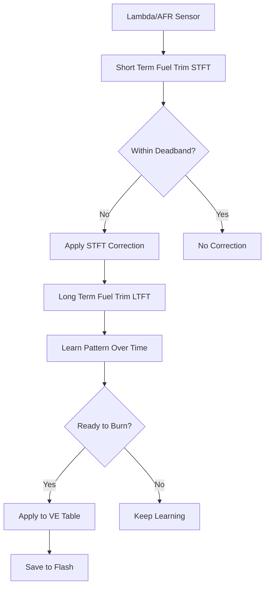
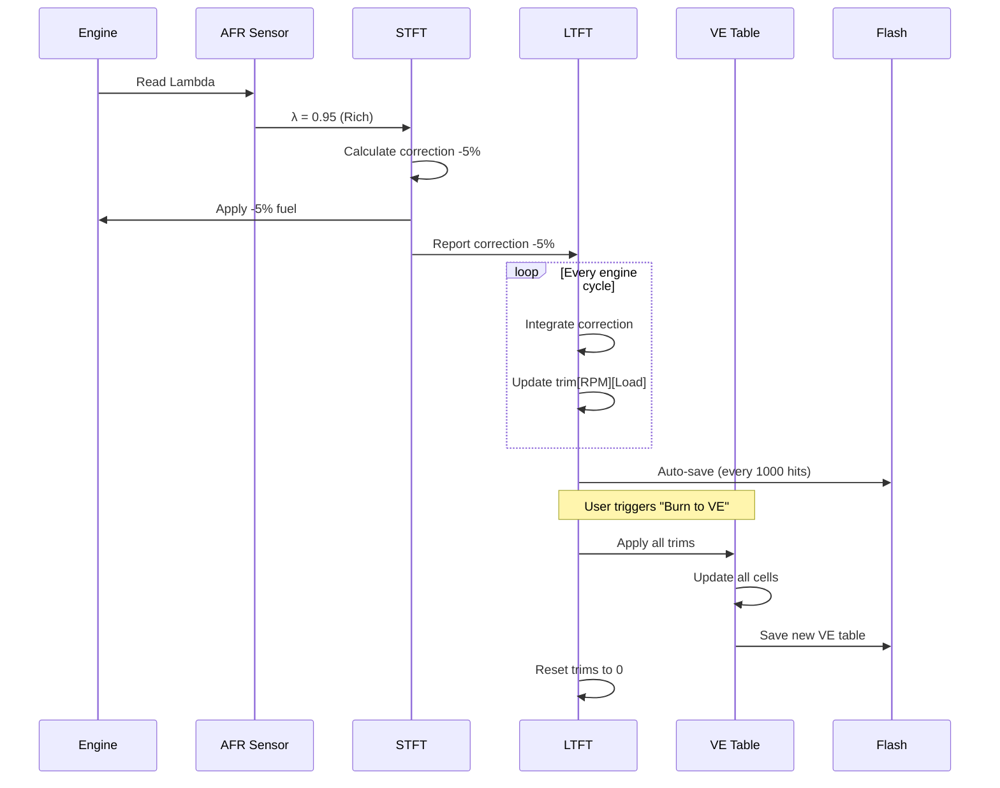

# Logika VE Table Auto-Tuning di RusEfi

## Overview
RusEfi memiliki sistem Closed-Loop Fuel Control yang **secara otomatis menyesuaikan VE table** saat mesin hidup berdasarkan pembacaan sensor AFR/Lambda. Sistem ini terdiri dari dua komponen utama:

1. **STFT (Short Term Fuel Trim)** - Koreksi jangka pendek real-time
2. **LTFT (Long Term Fuel Trim)** - Koreksi jangka panjang yang "belajar" dari STFT

## Arsitektur Sistem



## 1. Short Term Fuel Trim (STFT)

### Lokasi File
- [`controllers/math/closed_loop_fuel.cpp`](file:///Users/andikasulispratama/Documents/_DATA%20ANDIKA/RusEfi/fw-Warkop-X-ECU/ext/rusefi/firmware/controllers/math/closed_loop_fuel.cpp)

### Cara Kerja
STFT bekerja **real-time** dengan logika berikut:

```cpp
// Pseudocode dari closed_loop_fuel.cpp
if (AFR < Target_AFR) {
    // Terlalu kaya, kurangi fuel
    correction = -percentage;
} else if (AFR > Target_AFR) {
    // Terlalu kurus, tambah fuel
    correction = +percentage;
} else {
    // Dalam deadband, tidak perlu koreksi
    correction = 0;
}
```

### Kondisi STFT Aktif
STFT hanya bekerja jika kondisi ini terpenuhi:
- ✅ Engine sudah warm up (CLT > minimum configured)
- ✅ RPM dalam range normal (bukan idle atau overrun)
- ✅ AFR sensor valid
- ✅ Tidak sedang fuel cut
- ✅ Tidak sedang akselerasi tajam (TPS stable)

## 2. Long Term Fuel Trim (LTFT)

### Lokasi File
- [`controllers/long_term_fuel_trim.cpp`](file:///Users/andikasulispratama/Documents/_DATA%20ANDIKA/RusEfi/fw-Warkop-X-ECU/ext/rusefi/firmware/controllers/long_term_fuel_trim.cpp)

### Cara Kerja
LTFT **mempelajari pola dari STFT** dan menyimpannya ke dalam tabel trim 3D (RPM x Load):

#### Learning Algorithm (Line 104-177)

```cpp
void LongTermFuelTrim::learn(ClosedLoopFuelResult clResult, float rpm, float fuelLoad) {
    // 1. Cari cell terdekat di VE table
    auto x = getClosestBin(fuelLoad, config->veLoadBins);
    auto y = getClosestBin(rpm, config->veRpmBins);
    
    // 2. Skip jika terlalu jauh dari table center
    if ((abs(x.Frac) > 0.5) || (abs(y.Frac) > 0.5)) {
        return; // Di luar jangkauan table
    }
    
    // 3. Hitung weight berdasarkan jarak dari center cell
    float weight = 1.0 - hypotf(x.Frac, y.Frac) / hypotf(0.5, 0.5);
    float k = getIntegratorGain(cfg, region) * integrator_dt * weight;
    
    // 4. Integrator (low-pass filter)
    float lambdaCorrection = clResult.banks[bank] - 1.0;
    float trim = m_state->trims[bank][x.Idx][y.Idx];
    float newTrim = trim + k * (lambdaCorrection - trim);
    
    // 5. Clamp ke batas maksimal (+/-25%)
    newTrim = clampF(getMinAdjustment(cfg), newTrim, getMaxAdjustment(cfg));
    
    // 6. Simpan ke memory
    m_state->trims[bank][x.Idx][y.Idx] = newTrim;
    
    // 7. Save ke flash setiap 1000 hits
    if ((ltftCntHit % SAVE_AFTER_HITS) == 0) {
        settingsLtftRequestWriteToFlash();
    }
}
```

### Karakteristik Learning:
- **Weighted Learning**: Cell yang lebih dekat ke operating point dapat correction lebih besar
- **Integrator-based**: Menggunakan low-pass filter untuk smooth learning (tidak jerky)
- **Max Adjustment**: Default ±25% (`MAX_ADJ = 0.25f`)
- **Auto-save**: Setiap 1000 pembelajaran, data disimpan ke flash memory

## 3. Burning LTFT ke VE Table

### Apply Trims to VE (Line 57-76)

Ketika siap untuk "burn" LTFT ke VE table:

```cpp
void LtftState::applyToVe() {
    for (size_t loadIndex = 0; loadIndex < VE_LOAD_COUNT; loadIndex++) {
        for (size_t rpmIndex = 0; rpmIndex < VE_RPM_COUNT; rpmIndex++) {
            float k = 0;
            
            // Average dari semua bank (jika multi-bank)
            for (size_t bank = 0; bank < FT_BANK_COUNT; bank++) {
                k += 1.0f + trims[bank][loadIndex][rpmIndex];
            }
            k = k / FT_BANK_COUNT;
            
            // Apply multiplicative correction ke VE table
            config->veTable[loadIndex][rpmIndex] = config->veTable[loadIndex][rpmIndex] * k;
        }
    }
}
```

**Contoh:**
- VE table cell = **80%**
- LTFT trim = **+5%** (0.05)
- k = 1.0 + 0.05 = **1.05**
- New VE = 80% × 1.05 = **84%**

### Reset After Burn
Setelah apply to VE, LTFT trim di-reset ke 0 (line 257) sehingga learning mulai dari awal lagi.

## 4. VE Table Lookup

### Lokasi File
- [`controllers/math/speed_density.cpp`](file:///Users/andikasulispratama/Documents/_DATA%20ANDIKA/RusEfi/fw-Warkop-X-ECU/ext/rusefi/firmware/controllers/math/speed_density.cpp)
- [`controllers/algo/airmass/airmass.cpp`](file:///Users/andikasulispratama/Documents/_DATA%20ANDIKA/RusEfi/fw-Warkop-X-ECU/ext/rusefi/firmware/controllers/algo/airmass/airmass.cpp)

### VE Lookup Process (airmass.cpp:17-76)

```cpp
float AirmassVeModelBase::getVe(float rpm, float load, bool postState) const {
    // 1. Get base VE dari table (3D interpolation)
    percent_t ve = m_veTable->getValue(rpm, load);
    
    // 2. Jika idle, blend dengan idle VE table
    if (useSeparateVeForIdle && isIdling) {
        percent_t idleVe = interpolate3d(
            config->idleVeTable,
            config->idleVeLoadBins, idleVeLoad,
            config->idleVeRpmBins, rpm
        );
        
        // Interpolate antara idle dan normal table
        ve = interpolateClamped(idleThreshold / 2, idleVe, 
                                idleThreshold, ve, tps.Value);
    }
    
    // 3. Apply VE blends (jika dikonfigurasi)
    for (size_t i = 0; i < efi::size(config->veBlends); i++) {
        auto result = calculateBlend(config->veBlends[i], rpm, load);
        // Apply as multiplier: +5% means multiply by 1.05
        ve *= ((100 + result.Value) * 0.01f);
    }
    
    return ve * PERCENT_DIV; // Convert to 0-1 range
}
```

### VE Table Initialization (speed_density.cpp:108-110)

```cpp
void initSpeedDensity() {
    veMap.initTable(config->veTable, config->veRpmBins, config->veLoadBins);
}
```

## 5. Flow Diagram Complete



## 6. Configuration Parameters

### STFT Configuration
```cpp
stft_s {
    maxIdleRegionRpm;     // Max RPM untuk idle region
    maxOverrunLoad;       // Max load untuk overrun detection
    minPowerLoad;         // Min load untuk power enrichment region
    deadband;             // AFR deadband (% error to ignore)
    minClt;               // Minimum coolant temp
    minAfr, maxAfr;       // AFR range untuk learning
    startupDelay;         // Delay setelah engine start
}
```

### LTFT Configuration
```cpp
ltft_s {
    correctionEnabled;    // Enable/disable correction
    timeConstant[];       // Learning speed per region (1-3000s)
    maxAdd;              // Max fuel tambahan (default 25%)
    maxRemove;           // Max fuel dikurangi (default 25%)
}
```

## 7. Konfigurasi Board Anda

> [!WARNING]
> **LTFT mungkin DISABLED** di build Anda karena flash size constraint!

Cek di [`board.mk`](file:///Users/andikasulispratama/Documents/_DATA%20ANDIKA/RusEfi/fw-Warkop-X-ECU/board.mk):
```makefile
# Tidak ada disable flag untuk LTFT, jadi seharusnya ENABLED by default
# Namun fitur ini membutuhkan:
# - EFI_PROD_CODE=TRUE (untuk flash storage)
# - Lambda/AFR sensor yang valid
```

## 8. TunerStudio Interface

### Viewing LTFT Data
- LTFT trim data tersedia di TunerStudio live data page
- Dapat melihat trim per cell (RPM x Load)
- Progress indicator untuk learning

### Burning Process
Perintah TunerStudio untuk apply LTFT ke VE:
```cpp
// Function: applyLongTermFuelTrimToVe()
// Location: long_term_fuel_trim.cpp:317
void applyLongTermFuelTrimToVe() {
    engine->module<LongTermFuelTrim>()->applyTrimsToVe();
}
```

## Summary

**VE Table Auto-Tuning** di RusEfi bekerja dengan cara:

1. **STFT** membaca AFR sensor dan memberikan koreksi real-time
2. **LTFT** mempelajari pola koreksi STFT dan menyimpannya per cell (RPM x Load)
3. Setiap **1000 pembelajaran**, LTFT auto-save ke flash memory
4. User dapat **"burn"** LTFT ke VE table kapan saja
5. Setelah burn, VE table updated secara **multiplicative** (bukan additive)
6. LTFT trim di-reset ke 0, learning mulai dari awal

### Keuntungan Sistem Ini:
- ✅ **Auto-learning**: VE table menyesuaikan diri dengan kondisi real engine
- ✅ **Per-cell precision**: Setiap operating point (RPM x Load) dipelajari independen
- ✅ **Weight-based**: Cell yang sering dikunjungi dapat learning lebih cepat
- ✅ **Safe limits**: Max ±25% mencegah over-correction yang berbahaya
- ✅ **Persistent**: Data tersimpan di flash, tidak hilang saat reboot

---

**Status di Warkop X ECU**: 
- CAN Support disabled → **AFR sensor via analog input masih bisa!**
- Jika ada wideband AFR sensor (AEM UEGO, Innovate LC-2, dll), LTFT dapat digunakan untuk auto-tune VE table
